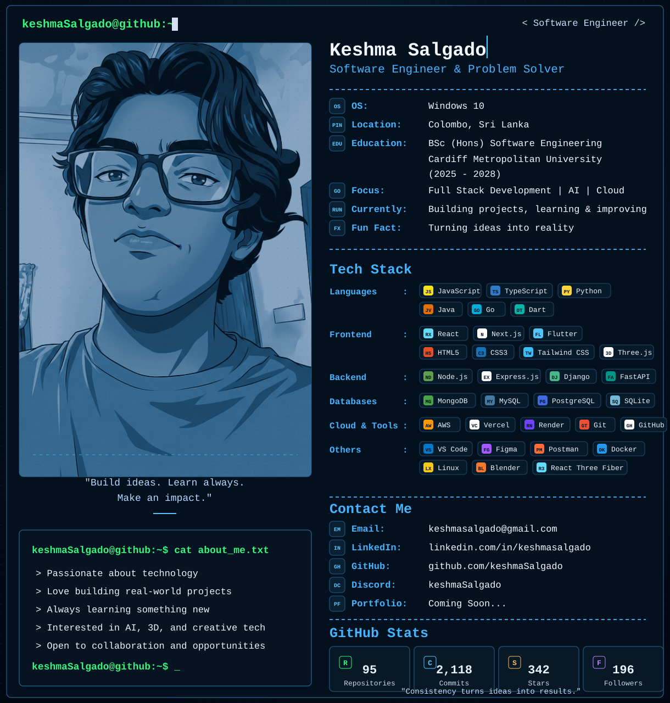

# keshmaSalgado

<picture>
  <source media="(prefers-color-scheme: dark)" srcset="./assets/profile_dark.svg">
  <source media="(prefers-color-scheme: light)" srcset="./assets/profile_light.svg">
  
</picture>

---

## `keshmaSalgado@github:~$ cat about_me.txt`

```text
> Passionate about technology
> Full-stack development
> Interested in AI, cloud and 3D
> Building real-world projects
> Always learning and improving
```

## `keshmaSalgado@github:~$ ./contact.sh`

```text
GitHub   : github.com/keshmaSalgado
LinkedIn : YOUR_LINKEDIN
Email    : YOUR_EMAIL
```

> Replace `YOUR_LINKEDIN` and `YOUR_EMAIL` before publishing.
